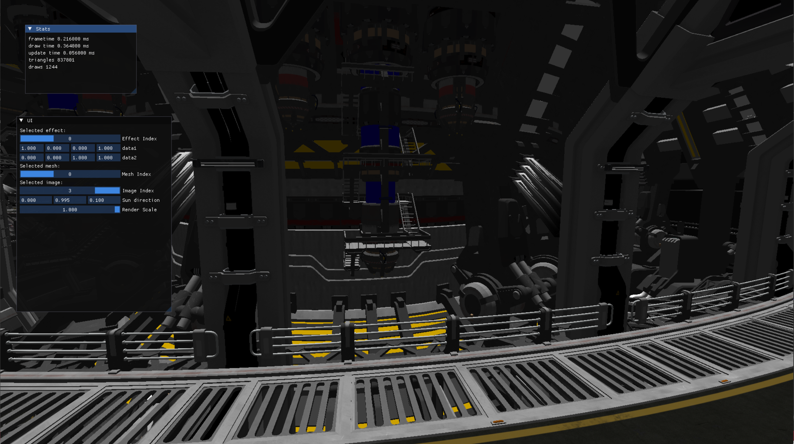

This is a lightweight rendering engine written in Vulkan based on the Vulkan Guide post: https://vkguide.dev/, which introduces the modern GPU features for real-time rendering.

Some of the modern engine features include:

1. drawing vertices using GPU memory pointer without using vertex buffer fixed function hardware for vertex processing. 
2. CPU frustum culling to cull draw calls.
3. Draw call sorting of transparent and opaque objects, respectively.
4. More precise synchronization and pipeline barrier compared to the original project.
5. dynamic rendering to set up the render attachments for draw calls.

The following frame runs on a RTX 2080 Ti and Intel(R) Core(TM) i9-10900K CPU @ 3.70GHz, 3696 Mhz, 10 Core(s), 20 Logical Processor(s).

